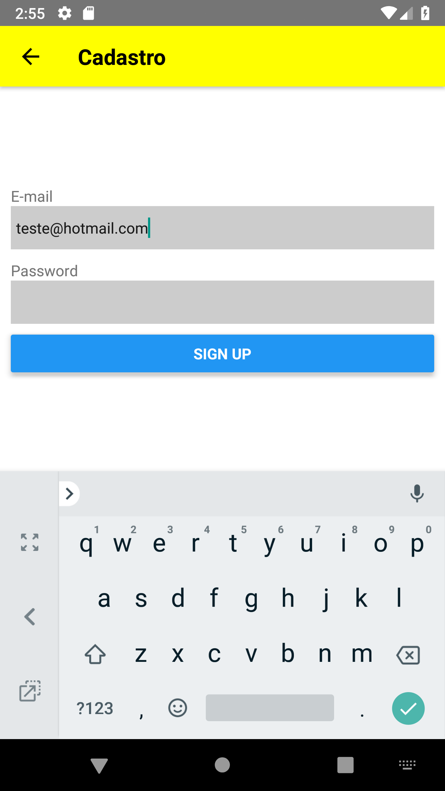
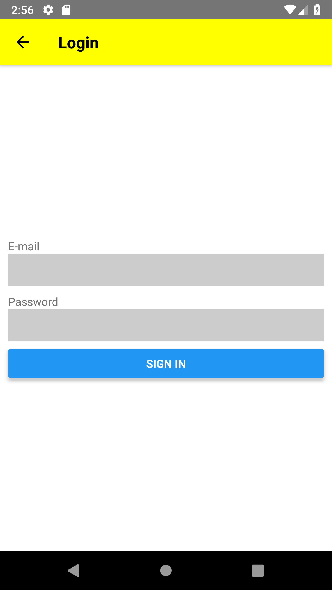
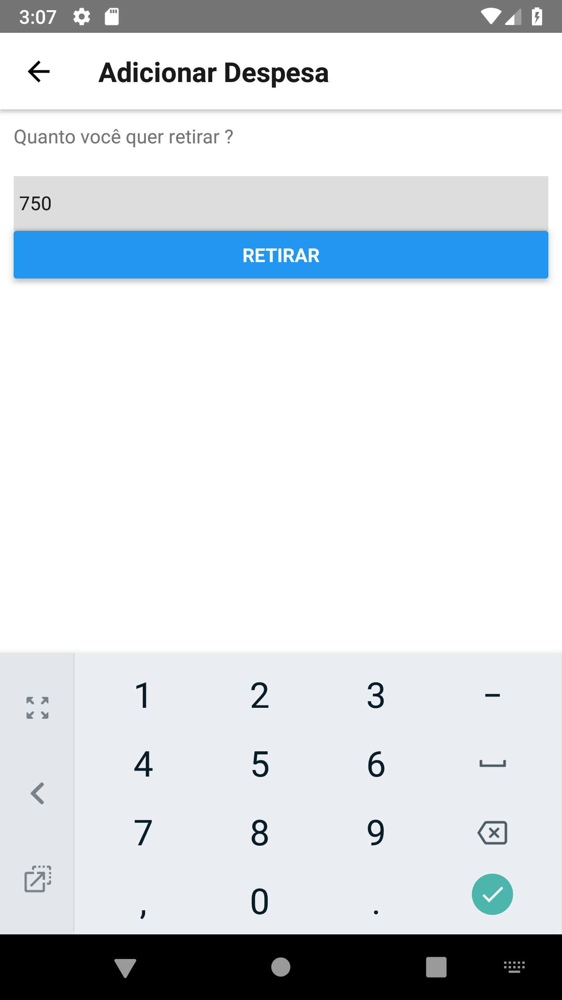

# Receita App
Aplicativo que faz o controle da entra de receitas e despesas do usuário.

## Screenshots
|  |  |  |
|---|---|---|
|  |  |  |

## As Tecnologias
**React-Native** - http://facebook.github.io/react-native/
Framework principal para desenvolvimento do aplicativo híbrido.

**React-Navigation** - https://github.com/react-navigation/react-navigation
Para a navegação entre telas

**React-Native-Firebase** - https://github.com/invertase/react-native-firebase
Para armazenamento dos Dados e autenticação dos usuário.
